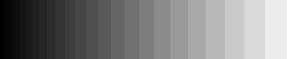

# gammaquant

> Demonstrates the effect of gamma correction to quantization

Here's a bar that goes from black to white:

Let's say we have to restrict our palette to 30 colors, but are free to choose *which* 30 colors.
Then one can break the regions at different positions:

<!-- find results/ -type f -printf '\n' | sort -->

Which one is the least noticable?  Hint: It's not the equidistant one.
(At least for me and probably many other people.)

## Table of Contents

- [Background](#background)
- [Install](#install)
- [Usage](#usage)
- [Contribute](#contribute)

## Background

Quantization loses data by definition.  Therefore it is important to choose
the output palette wisely.  The standard approach is uniform sampling.
This approach silently assumes that the visual distance between colors is the
same as the numeric distance.  For example the numeric distance between
(10, 10, 10) and (20, 20, 20) is the same as between (210, 210, 210) and (220, 220, 220).
However, the first pair "looks" further apart than the second pair.
This is what [gamma correction](https://en.wikipedia.org/wiki/Gamma_correction#Power_law_for_video_display) is about:
It translates the color space into something where numeric distances
are a good indication of visual distance.

This project illustrates this point by providing code and example images for that.  (Images see above).

## Install

There is nothing to install.  Usually.
If you seriously didn't have Pillow already installed, run `pip install Pillow`
(or if on Debian, then `pip3 install Pillow`).

## Usage

Run `./gammaquant.py` and enjoy the results.  You can change the parameters by tweaking `TEST_PARAMS`.

## Contribute

Feel free to dive in! [Open an issue](https://github.com/BenWiederhake/gammaquant/issues/new) or submit PRs.
